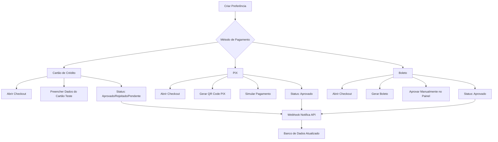

# Guia de Teste: Métodos de Pagamento (Cartão, PIX, Boleto)

Este guia mostra como testar diferentes métodos de pagamento reais usando cartões de teste, PIX e Boleto do MercadoPago.

## 📋 Pré-requisitos

1. ✅ Docker containers rodando (PostgreSQL + MinIO)
2. ✅ Servidor NestJS executando (`npm run start:dev`)
3. ✅ Token de TESTE do MercadoPago configurado no `.env`
4. ✅ **APP_URL** configurada no `.env` (ex: `APP_URL=http://localhost:3000`)
5. ✅ Insomnia instalado com a coleção `insomnia_payments_metodos.json`

### Configuração do .env

Certifique-se de que seu `.env` contém:

```bash
# MercadoPago
MERCADOPAGO_ACCESS_TOKEN=TEST-1234567890-012345-abc...

# App URL (obrigatório para URLs de retorno de pagamento)
APP_URL=http://localhost:3000
PORT=3000
```

**⚠️ IMPORTANTE**: O `APP_URL` é necessário para que o MercadoPago saiba para onde redirecionar após o pagamento.

## 🎯 Visão Geral dos Métodos



## 🔐 1. Autenticação

Primeiro, faça login para obter o token JWT:

```bash
# 1. Registrar usuário (se ainda não existir)
POST http://localhost:3000/auth/register
{
  "name": "Comprador Teste",
  "email": "comprador@teste.com",
  "password": "Senha123!@"
}

# 2. Fazer login
POST http://localhost:3000/auth/login
{
  "email": "comprador@teste.com",
  "password": "Senha123!@"
}

# 3. Copiar o token JWT da resposta
# Configurar no Insomnia: Ambiente > jwt_token
```

## 💳 2. Testar Cartão de Crédito

### Cartões de Teste do MercadoPago

O MercadoPago fornece cartões de teste que simulam diferentes cenários:

| Cartão | Código | Vencimento | Nome do Titular | Status Esperado |
|--------|--------|------------|-----------------|-----------------|
| 5031 4332 1540 6351 | 123 | 11/25 | **APRO** | ✅ **Aprovado** |
| 5031 4332 1540 6351 | 123 | 11/25 | **OTHE** | ❌ **Rejeitado** (erro) |
| 5031 4332 1540 6351 | 123 | 11/25 | **CONT** | ⏳ **Pendente** (contestação) |
| 5031 4332 1540 6351 | 123 | 11/25 | **CALL** | ❌ **Rejeitado** (autorizar) |
| 5031 4332 1540 6351 | 123 | 11/25 | **FUND** | ❌ **Rejeitado** (saldo insuficiente) |
| 5031 4332 1540 6351 | 123 | 11/25 | **SECU** | ❌ **Rejeitado** (código de segurança) |
| 5031 4332 1540 6351 | 123 | 11/25 | **EXPI** | ❌ **Rejeitado** (vencimento) |
| 5031 4332 1540 6351 | 123 | 11/25 | **FORM** | ❌ **Rejeitado** (erro no formulário) |

**📝 IMPORTANTE**: O status do pagamento é determinado pelo **NOME DO TITULAR** do cartão!

### Passo a Passo - Cartão de Crédito

#### 2.1. Criar Preferência de Pagamento

```bash
POST http://localhost:3000/payments/create-preference
Authorization: Bearer SEU_TOKEN_JWT
Content-Type: application/json

{
  "title": "Produto Teste - Cartão Crédito",
  "description": "Pagamento teste com cartão aprovado",
  "unitPrice": 100.00,
  "quantity": 1
}
```

**Resposta esperada:**
```json
{
  "payment": {
    "id": "clx...",
    "preferenceId": "123456789-abc...",
    "status": "PENDING",
    "amount": 100,
    "externalReference": "user-clx...-1234567890"
  },
  "preference": {
    "id": "123456789-abc...",
    "init_point": "https://www.mercadopago.com.br/checkout/v1/redirect?pref_id=...",
    "sandbox_init_point": "https://sandbox.mercadopago.com.br/checkout/v1/redirect?pref_id=..."
  }
}
```

#### 2.2. Abrir Checkout e Pagar

1. **Copie a URL** `init_point` ou `sandbox_init_point` da resposta
2. **Cole no navegador** para abrir o checkout do MercadoPago
3. **Preencha os dados do cartão teste**:
   - Número: `5031 4332 1540 6351`
   - Nome: `APRO` (para aprovado)
   - Vencimento: `11/25`
   - Código: `123`
   - CPF: `12345678909`
4. **Clique em "Pagar"**

#### 2.3. Verificar Status

Após alguns segundos, o webhook será chamado automaticamente e o pagamento será atualizado:

```bash
# Consultar histórico
GET http://localhost:3000/payments/user/history
Authorization: Bearer SEU_TOKEN_JWT
```

**Resposta esperada:**
```json
[
  {
    "id": "clx...",
    "status": "APPROVED",
    "statusDetail": "accredited",
    "amount": 100,
    "paymentMethodId": "master",
    "paymentTypeId": "credit_card",
    "dateApproved": "2026-02-02T00:00:00.000Z"
  }
]
```

### 2.4. Testar Outros Cenários

Repita os passos 2.1 a 2.3, mas use nomes diferentes no cartão:

- **OTHE**: Para simular rejeição por erro genérico
- **CONT**: Para simular pagamento pendente de revisão
- **FUND**: Para simular saldo insuficiente

## 🟢 3. Testar PIX

### Passo a Passo - PIX

#### 3.1. Criar Preferência com PIX

```bash
POST http://localhost:3000/payments/create-preference
Authorization: Bearer SEU_TOKEN_JWT
Content-Type: application/json

{
  "title": "Produto Teste - PIX",
  "description": "Pagamento teste via PIX",
  "unitPrice": 50.00,
  "quantity": 1
}
```

#### 3.2. Abrir Checkout e Selecionar PIX

1. **Abra o `init_point`** retornado
2. **Selecione "PIX"** como forma de pagamento
3. **Visualize o QR Code** gerado pelo MercadoPago
4. **Copie o código Pix** (copia e cola)

#### 3.3. Simular Pagamento PIX (Ambiente de Teste)

Em ambiente de teste, o PIX não processa pagamentos reais. Você tem 3 opções:

**Opção A: Aprovação Manual no Painel**
1. Acesse o [Painel do MercadoPago](https://www.mercadopago.com.br/developers/panel)
2. Vá em "Pagamentos" → "Transações"
3. Localize o pagamento PIX pendente
4. Clique em "Aprovar manualmente"

**Opção B: Usar Webhook Simulado**
```bash
POST http://localhost:3000/webhooks/mercadopago
Content-Type: application/json

{
  "action": "payment.updated",
  "data": {
    "id": "PAYMENT_ID_DO_PIX"
  },
  "type": "payment"
}
```

**Opção C: Aguardar Expiração Automática**
- Pagamentos PIX em teste expiram em 30 minutos
- Após expiração, status muda para `cancelled`

#### 3.4. Verificar Aprovação

```bash
GET http://localhost:3000/payments/user/history
Authorization: Bearer SEU_TOKEN_JWT
```

Status esperado: `APPROVED` com `paymentMethodId: "pix"`

## 📄 4. Testar Boleto

### Passo a Passo - Boleto

#### 4.1. Criar Preferência com Boleto

```bash
POST http://localhost:3000/payments/create-preference
Authorization: Bearer SEU_TOKEN_JWT
Content-Type: application/json

{
  "title": "Produto Teste - Boleto",
  "description": "Pagamento teste via Boleto Bancário",
  "unitPrice": 200.00,
  "quantity": 1
}
```

#### 4.2. Abrir Checkout e Gerar Boleto

1. **Abra o `init_point`** retornado
2. **Selecione "Boleto Bancário"** como forma de pagamento
3. **Preencha seus dados** (nome, CPF, endereço)
4. **Gere o boleto**
5. **Visualize o PDF** do boleto (linha digitável + código de barras)

#### 4.3. Simular Pagamento do Boleto

Em ambiente de teste, boletos não podem ser pagos em bancos reais:

**Opção A: Aprovação Manual (Recomendado)**
1. Acesse o [Painel do MercadoPago](https://www.mercadopago.com.br/developers/panel)
2. Vá em "Pagamentos" → "Transações"
3. Localize o boleto pendente
4. Clique em "Aprovar manualmente"
5. Webhook notifica sua API automaticamente

**Opção B: Usar Webhook Simulado**
```bash
POST http://localhost:3000/webhooks/mercadopago
Content-Type: application/json

{
  "action": "payment.updated",
  "data": {
    "id": "PAYMENT_ID_DO_BOLETO"
  },
  "type": "payment"
}
```

#### 4.4. Verificar Status

```bash
GET http://localhost:3000/payments/user/history
Authorization: Bearer SEU_TOKEN_JWT
```

Status esperado: `APPROVED` com `paymentMethodId: "bolbradesco"` (ou outro banco)

## 🔄 5. Fluxo Completo de Teste

### Ordem Recomendada de Testes

```bash
# 1. Login
POST /auth/login → Copiar JWT

# 2. Teste Cartão APROVADO
POST /payments/create-preference (unitPrice: 100)
→ Abrir init_point
→ Pagar com cartão APRO
→ Aguardar webhook (5-10 segundos)
→ GET /payments/user/history (status: APPROVED)

# 3. Teste Cartão REJEITADO
POST /payments/create-preference (unitPrice: 150)
→ Abrir init_point
→ Pagar com cartão FUND
→ Ver erro de saldo insuficiente
→ GET /payments/user/history (status: REJECTED)

# 4. Teste PIX
POST /payments/create-preference (unitPrice: 50)
→ Abrir init_point
→ Selecionar PIX
→ Copiar QR Code
→ Aprovar manualmente no painel
→ GET /payments/user/history (status: APPROVED, method: pix)

# 5. Teste Boleto
POST /payments/create-preference (unitPrice: 200)
→ Abrir init_point
→ Selecionar Boleto
→ Gerar boleto
→ Aprovar manualmente no painel
→ GET /payments/user/history (status: APPROVED, method: bolbradesco)
```

## 🐛 Troubleshooting

### ❌ Problema: "auto_return invalid. back_url.success must be defined"

**Causa**: Variável `APP_URL` não configurada no `.env`

**Solução**:
1. Adicione ao `.env`:
```bash
APP_URL=http://localhost:3000
```
2. Reinicie o servidor: `npm run start:dev`
3. Tente criar o pagamento novamente

### ❌ Problema: "PA_UNAUTHORIZED_RESULT_FROM_POLICIES"

**Causa**: Token do MercadoPago inválido ou expirado

**Solução**:
1. Acesse o [Painel de Credenciais](https://www.mercadopago.com.br/developers/panel/credentials)
2. Copie o **Access Token de TESTE** (começa com `TEST-`)
3. Atualize o `.env`:
```bash
MERCADOPAGO_ACCESS_TOKEN=TEST-1234567890-012345-abc...
```
4. Reinicie o servidor: `npm run start:dev`

### ❌ Problema: Webhook não é chamado automaticamente

**Causa**: MercadoPago não consegue acessar `localhost`

**Solução A: Usar ngrok (Recomendado)**
```bash
# 1. Instalar ngrok
npm install -g ngrok

# 2. Expor servidor local
ngrok http 3000

# 3. Copiar URL pública (ex: https://abc123.ngrok.io)

# 4. Configurar webhook no MercadoPago
# Painel → Aplicação → Webhooks
# URL: https://abc123.ngrok.io/webhooks/mercadopago
```

**Solução B: Simular webhook manualmente**
```bash
POST http://localhost:3000/webhooks/mercadopago
Content-Type: application/json

{
  "action": "payment.updated",
  "data": {
    "id": "PAYMENT_ID_COPIADO_DO_PAINEL"
  },
  "type": "payment"
}
```

### ❌ Problema: Status do pagamento não muda de PENDING

**Verificações**:
1. ✅ Pagamento foi completado no checkout?
2. ✅ Webhook foi configurado corretamente?
3. ✅ Token de teste está válido?
4. ✅ `externalReference` está correto no banco?

**Verificar logs do servidor**:
```bash
# Logs devem mostrar:
[PaymentsService] Payment preference created: 123456789-abc...
[PaymentsService] Payment updated: clx... - Status: APPROVED
```

### ❌ Problema: Cartão de teste não funciona

**Verificações**:
1. ✅ Usando o número correto: `5031 4332 1540 6351`
2. ✅ Nome do titular define o status: `APRO`, `OTHE`, `CONT`, etc.
3. ✅ Código de segurança: `123`
4. ✅ Vencimento futuro: `11/25` ou posterior
5. ✅ Token é de TESTE (não PRODUÇÃO)

### ❌ Problema: PIX não gera QR Code

**Causa**: Credenciais de TESTE não suportam PIX em alguns países

**Solução**:
1. Verifique se sua conta está configurada para Brasil
2. Acesse o painel e valide que PIX está habilitado para testes
3. Use Cartão de Crédito como alternativa

## 📚 Recursos Adicionais

### Documentação Oficial

- [Cartões de Teste - MercadoPago](https://www.mercadopago.com.br/developers/pt/docs/checkout-api/integration-test/test-cards)
- [Webhooks - Configuração](https://www.mercadopago.com.br/developers/pt/docs/checkout-api/additional-content/notifications/webhooks)
- [Status de Pagamentos](https://www.mercadopago.com.br/developers/pt/docs/checkout-api/additional-content/payment-status)

### Links Úteis

- **Painel do MercadoPago**: https://www.mercadopago.com.br/developers/panel
- **Credenciais de Teste**: https://www.mercadopago.com.br/developers/panel/credentials
- **ngrok Download**: https://ngrok.com/download

## ✅ Checklist de Testes Completos

- [ ] ✅ Login e obtenção de JWT
- [ ] 💳 Cartão de crédito APROVADO (APRO)
- [ ] ❌ Cartão de crédito REJEITADO (FUND/OTHE)
- [ ] ⏳ Cartão de crédito PENDENTE (CONT)
- [ ] 🟢 PIX aprovado (manual ou webhook)
- [ ] 📄 Boleto aprovado (manual ou webhook)
- [ ] 🔍 Consultar histórico de pagamentos
- [ ] 🔍 Buscar pagamento específico por ID
- [ ] 🔔 Webhook recebido e processado corretamente
- [ ] 💾 Banco de dados atualizado com status correto

## 🎉 Próximos Passos

Após validar todos os métodos de pagamento em ambiente de teste:

1. **Obter credenciais de PRODUÇÃO** no painel do MercadoPago
2. **Configurar webhook permanente** (sem ngrok)
3. **Testar com valores reais pequenos** (R$ 0,10)
4. **Implementar emails de confirmação** de pagamento
5. **Adicionar logs e monitoramento** de transações
6. **Configurar retry de webhooks** falhados

---

**Última atualização**: 02/02/2026
