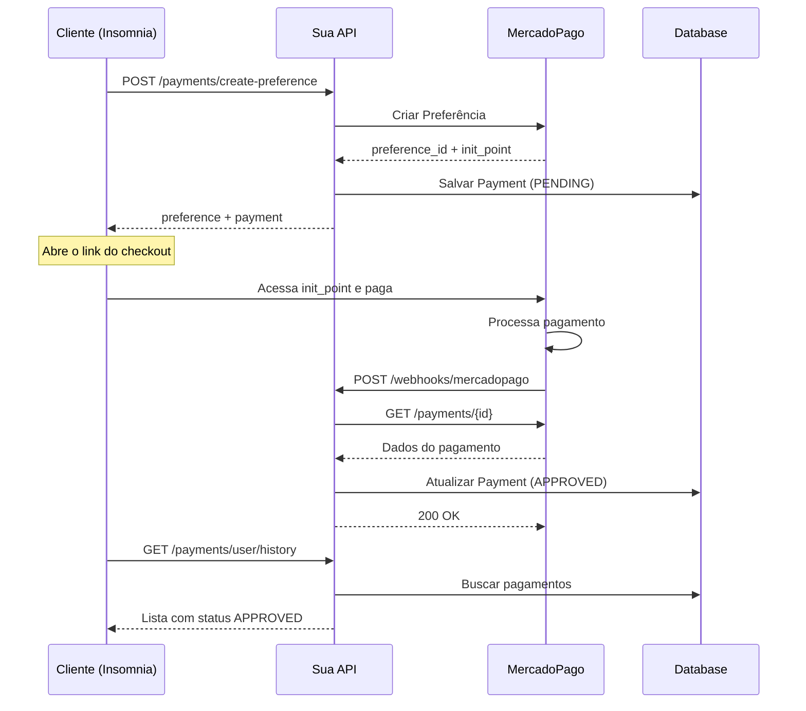

# 🧪 Guia: Como Testar Pagamento MercadoPago

Este guia explica como testar o fluxo completo de pagamento com MercadoPago localmente.

## 📋 Pré-requisitos

1. ✅ Access Token do MercadoPago configurado no `.env`
2. ✅ Aplicação rodando (`npm run start:dev`)
3. ✅ Insomnia com a coleção `insomnia_payments.json` importada
4. ✅ Usuário registrado e token JWT válido

## 🎯 Fluxo Completo de Teste

### Passo 1: Autenticação

1. **Registrar usuário** (se ainda não tiver):
   ```
   POST /auth/register
   {
     "email": "teste@exemplo.com",
     "password": "senha123",
     "name": "Usuário Teste"
   }
   ```

2. **Fazer login**:
   ```
   POST /auth/login
   {
     "email": "teste@exemplo.com",
     "password": "senha123"
   }
   ```

3. **Copiar o `accessToken`** da resposta e colar na variável `token` do ambiente do Insomnia

### Passo 2: Criar Preferência de Pagamento

1. **Executar request** `Criar Preferência de Pagamento`:
   ```
   POST /payments/create-preference
   Authorization: Bearer {seu_token}
   
   {
     "title": "Produto Teste",
     "description": "Descrição do produto de teste",
     "unitPrice": 99.90,
     "quantity": 1
   }
   ```

2. **Na resposta**, você receberá:
   ```json
   {
     "payment": {
       "id": "uuid-do-pagamento",
       "preferenceId": "123456789-abc123...",
       "externalReference": "user-uuid-timestamp",
       "status": "PENDING",
       ...
     },
     "preference": {
       "id": "123456789-abc123...",
       "initPoint": "https://www.mercadopago.com.br/checkout/v1/redirect?pref_id=...",
       "sandboxInitPoint": "https://sandbox.mercadopago.com.br/checkout/v1/redirect?pref_id=..."
     }
   }
   ```

3. **Anote os seguintes dados**:
   - `payment.id` - UUID do pagamento no seu banco
   - `payment.externalReference` - Referência externa
   - `preference.sandboxInitPoint` - Link para fazer o pagamento teste

### Passo 3: Realizar o Pagamento (2 opções)

#### Opção A: Pagamento Real no MercadoPago (Ambiente de Teste)

1. **Abra o link** `sandboxInitPoint` no navegador
2. **Use um cartão de teste**:
   
   | Cartão | Número | CVV | Validade | Resultado |
   |--------|--------|-----|----------|-----------|
   | Mastercard | 5031 4332 1540 6351 | 123 | 11/25 | ✅ Aprovado |
   | Visa | 4509 9535 6623 3704 | 123 | 11/25 | ✅ Aprovado |
   | Mastercard | 5031 7557 3453 0604 | 123 | 11/25 | ❌ Rejeitado |

3. **Dados do titular**:
   - Nome: APRO (para aprovar) ou CONT (para rejeitar)
   - CPF: 12345678909
   - Email: test@test.com

4. **Após o pagamento**, o MercadoPago:
   - Te redirecionará para a URL de sucesso
   - **Enviará um webhook** para `notification_url` (se configurado)
   - Gerará um **Payment ID**

5. **Para desenvolvimento local**, use **ngrok** para receber webhooks:
   ```bash
   ngrok http 3000
   ```
   
   Depois configure `APP_URL` no `.env`:
   ```env
   APP_URL=https://seu-id.ngrok.io
   ```

#### Opção B: Simular Webhook Manualmente (Mais Rápido)

Se você não quer usar ngrok ou fazer o pagamento real, pode simular o webhook:

1. **Primeiro, anote o `externalReference`** do pagamento criado no Passo 2

2. **Simule um Payment ID** fictício (ex: `1234567890`)

3. **Execute o request** `⚠️ Simular Webhook - Payment.Updated`:
   
   ```json
   POST /webhooks/mercadopago
   
   {
     "action": "payment.updated",
     "type": "payment",
     "data": {
       "id": "1234567890"
     },
     "date_created": "2026-02-01T12:00:00.000-03:00",
     "id": 12345,
     "live_mode": false,
     "user_id": "123456",
     "api_version": "v1"
   }
   ```

   ⚠️ **IMPORTANTE**: Como não há um payment real no MercadoPago com esse ID, o webhook vai tentar buscar e pode falhar. 

   Para simular corretamente, você precisaria:
   - Criar o pagamento real no ambiente de teste do MercadoPago (Opção A)
   - OU adaptar o código para aceitar webhooks mockados

### Passo 4: Verificar Status do Pagamento

1. **Buscar pagamento por ID**:
   ```
   GET /payments/{payment-id}
   Authorization: Bearer {seu_token}
   ```

2. **Ver histórico de pagamentos**:
   ```
   GET /payments/user/history
   Authorization: Bearer {seu_token}
   ```

## 🔍 Entendendo o Fluxo



## 🐛 Troubleshooting

### Erro: "PA_UNAUTHORIZED_RESULT_FROM_POLICIES"
- ✅ Verifique se o Access Token está correto
- ✅ Use token de TESTE (começa com `TEST-`)
- ✅ Gere um novo token no painel do MercadoPago

### Webhook não está sendo recebido
- ✅ Use ngrok para expor localhost
- ✅ Configure `APP_URL` no `.env` com a URL do ngrok
- ✅ Recrie a preferência após configurar o ngrok

### Payment não atualiza após webhook
- ✅ Verifique os logs no console
- ✅ Confirme que o `externalReference` está correto
- ✅ Verifique se o Payment ID do webhook é válido

## 📝 Resumo Rápido

Para um teste rápido SEM pagamento real:

1. ✅ Criar preferência → Anote `externalReference`
2. ✅ Simular webhook manualmente com Payment ID fictício
3. ⚠️ Lembre-se que o webhook vai falhar ao buscar o payment no MercadoPago

Para um teste COMPLETO:

1. ✅ Instalar ngrok: `npm install -g ngrok`
2. ✅ Rodar ngrok: `ngrok http 3000`
3. ✅ Configurar `APP_URL` no `.env`
4. ✅ Reiniciar aplicação
5. ✅ Criar preferência
6. ✅ Abrir link e pagar com cartão de teste
7. ✅ Webhook será processado automaticamente

## 🎓 Cartões de Teste

| Status | Nome | Cartão | CVV | Data |
|--------|------|--------|-----|------|
| ✅ Aprovado | APRO | 5031 4332 1540 6351 | 123 | 11/25 |
| ❌ Rejeitado | OTHE | 5031 7557 3453 0604 | 123 | 11/25 |
| ⏳ Pendente | CALL | 5031 4332 1540 6351 | 123 | 11/25 |

CPF: **12345678909**  
Email: **test@test.com**

Mais cartões: [MercadoPago Docs - Cartões de Teste](https://www.mercadopago.com.br/developers/pt/docs/checkout-api/testing)
